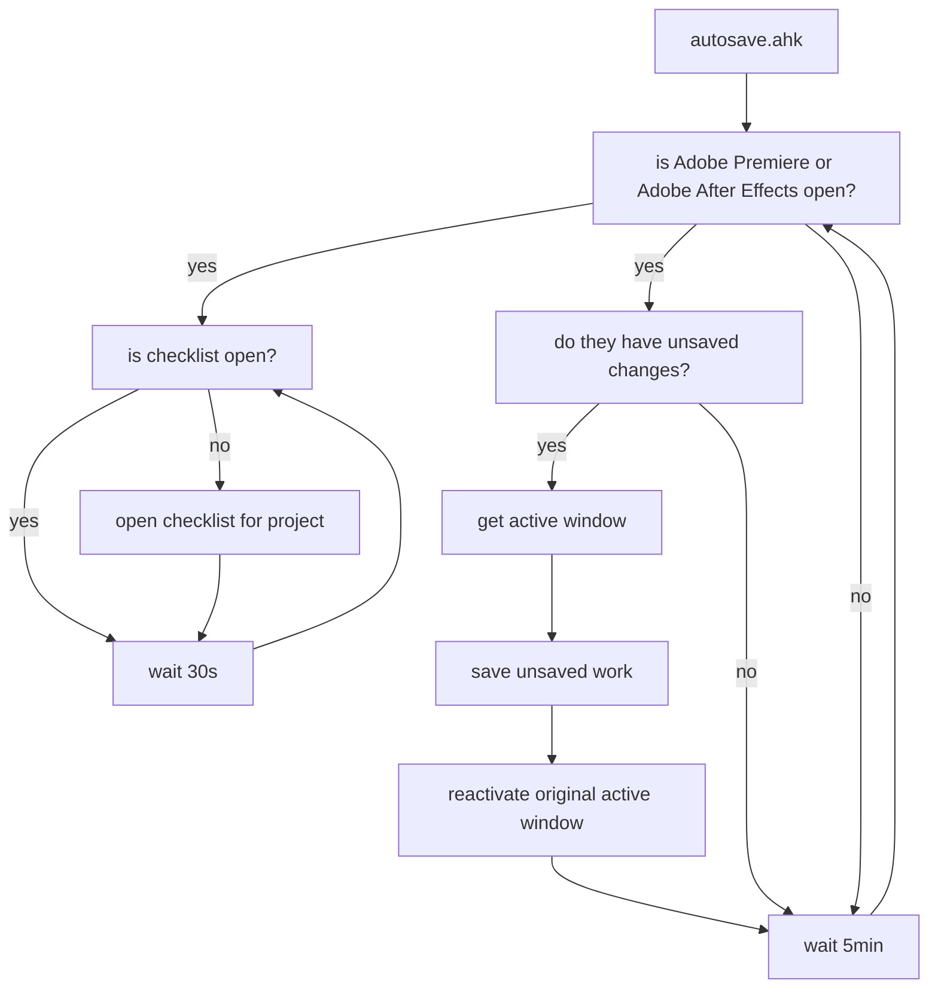

Adobe products are notoriously known for their instability and overall untrustworthy behaviour. After losing one too many projects to a crash only to find autosave hadn't actually saved at all in the last 30 minutes, I looked to find a solution.

`autosave.ahk` is that solution.

This script holds two main functions;

- Autosave `unsaved` work every `5min`.
- Make sure `checklist.ahk` is open.

First up, this script will grab information about the active window so we can reactivate it later if necessary, it will then check the title of any open `Premiere Pro` and `After Effects` window for a little `*` - an asterisk indicates that changes have been made and aren't saved. If Premiere requires saving, this function can do so without needing to bring focus to premiere at all, so the user will not even realise it's happening - on the other hand After Effects is a bit stranger; saving After effects, even in the background will FORCE it to become the focused window. Annoying. So what this script does to compensate is this;

- If a save is required, and After Effects is the `active window`, then simple, just save with `^s`
- If After Effects isn't the active window however, first this script will `WinSetTransparent` After Effects so that it becomes invisible, it will then save the current project and wait for the save dialog box to disappear, it will then `WinMoveBottom` to force After Effects to the bottom making it no longer the active window, then we will reactivate the originally active window, then reset After Effects' transparency so the user can see it again if they tab back into it.

While doing it this way has the benefit of not forcing focus to After Effects and therefor not flashing it on the screen, it has the downside of seemingly randomly vanishing from view if After Effects is visible on the screen but not the active window.

If premiere was the original active window and you were playing back footage on the timeline, this script should begin playback again once saving is complete. If you were playing back spedup, unfortunately there's no way to distinguish that and only normal speed playback can be returned.

